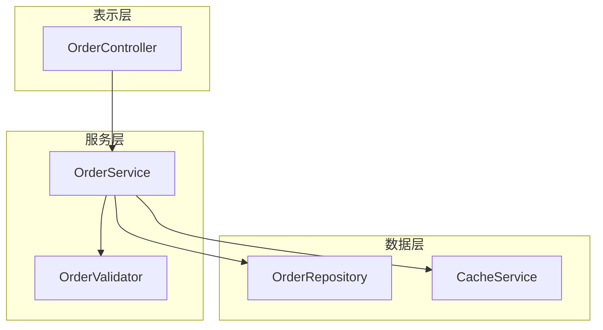
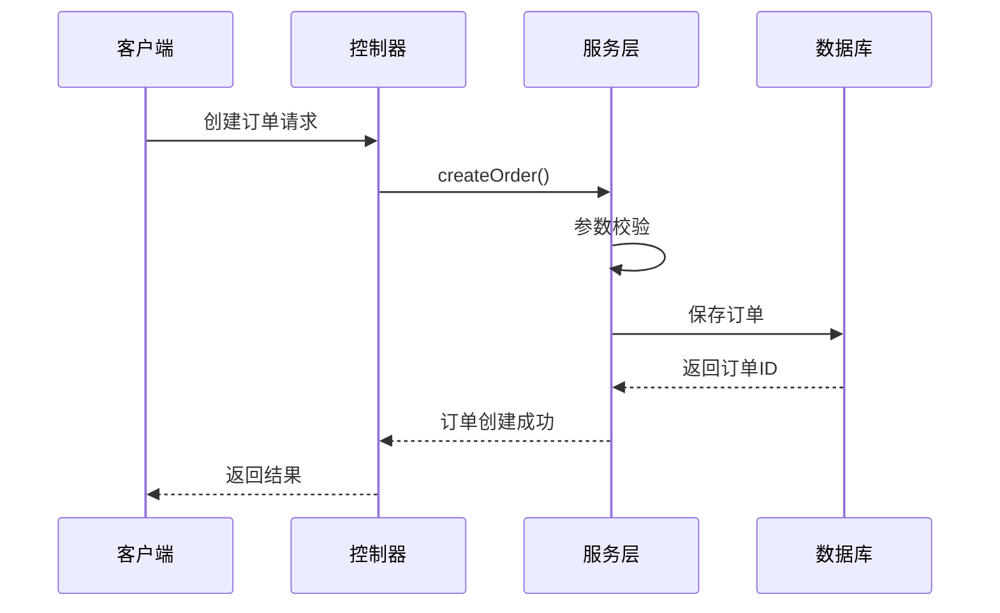

# learn-code

# 代码阅读引导

## 概述

帮助用户从零开始理解任意代码逻辑，通过层次化的解读文档，引导用户一步步掌握代码结构和实现细节。

**核心功能：** 定位代码 → 分析结构 → 生成层次化文档 → 支持追问

**输出位置：** `~/.cursor/conan-knowledge/learn-code/[YYYY-MM-DD]-[module-name]/`

**目录结构示例**：

```
~/.cursor/conan-knowledge/learn-code/
└── 2025-12-19-order-service/
    ├── index.md              # 主文档（层次化解读）
    ├── deep-dive-01.md       # 追问生成的补充文档
    └── deep-dive-02.md       # 追问生成的补充文档
```

## 参数格式

```bash
/learn-code <目标>
```

**目标参数**支持多种形式：

| 形式     | 示例                    | AI 处理方式              |
| -------- | ----------------------- | ------------------------ |
| 目录路径 | `./src/services/order/` | 直接读取目录下所有文件   |
| 文件路径 | `OrderService.java`     | 直接读取文件             |
| 类名     | `OrderValidator`        | grep 搜索定位            |
| 函数名   | `validateOrder`         | grep 搜索定位            |
| 需求描述 | `"订单校验逻辑"`        | codebase_search 语义搜索 |

## 执行步骤

### 1. 解析用户输入

根据输入内容判断类型并定位代码：

```bash
# 如果是路径（包含 / 或 .）
ls -la <路径>
cat <文件路径>

# 如果是类名/函数名（无空格的标识符）
grep -rn "<标识符>" --include="*.java" --include="*.py" --include="*.ts" .

# 如果是描述性文字（包含空格或中文）
# 使用 codebase_search 语义搜索
```

### 2. 分析代码结构

AI 分析定位到的代码，提取以下信息：

- **模块边界**：确定分析范围，找出核心文件
- **依赖关系**：识别 import/require，构建依赖图
- **类/函数结构**：提取类继承、接口实现、函数调用关系
- **核心流程**：识别主要执行路径
- **关键实现**：标记重要的算法、逻辑、设计模式

### 3. 生成层次化文档

按照固定结构生成 Markdown 文档：

````markdown
# 代码解读：[模块名称]

> 生成时间：YYYY-MM-DD HH:mm
> 代码范围：[用户输入的范围]

## 目录

- [一句话概述](#一句话概述)
- [架构全景](#架构全景)
- [模块拆解](#模块拆解)
- [核心流程](#核心流程)
- [关键实现](#关键实现)
- [延伸阅读](#延伸阅读)

---

## 一句话概述

[用一句话描述这个模块/功能的核心职责]

## 架构全景

[Mermaid 组件关系图]

| 组件 | 职责 | 关键文件 |
| ---- | ---- | -------- |
| ...  | ...  | ...      |

## 模块拆解

### [模块 1 名称]

- **职责**：...
- **关键类/函数**：...
- **依赖**：...

### [模块 2 名称]

...

## 核心流程

[Mermaid 时序图或流程图]

**步骤说明**：

1. [步骤 1]：...
2. [步骤 2]：...
3. ...

## 关键实现

### [实现点 1 标题]

```[语言]
[关键代码片段]
```
````

**解释**：...

### [实现点 2 标题]

...

## 延伸阅读

**相关文件**：

- `path/to/related/file1.java` - [简要说明]
- `path/to/related/file2.java` - [简要说明]

**建议进一步了解**：

- [相关概念或模块 1]
- [相关概念或模块 2]

````
### 4. 保存文档

```bash
# 创建需求目录（如果不存在）
# 目录名格式：[YYYY-MM-DD]-[module-name]
mkdir -p ~/.cursor/conan-knowledge/learn-code/2025-12-19-order-service/

# 保存主文档
# 主文档固定命名为 index.md
````

### 5. 输出摘要到 Chat

文档生成后，在 Chat 中输出：

```markdown
✅ 代码解读文档已生成

📄 **目录**：`~/.cursor/conan-knowledge/learn-code/2025-12-19-order-service/`
📄 **主文档**：`index.md`

## 快速概览

[一句话概述内容]

## 包含章节

1. 架构全景 - 组件关系图
2. 模块拆解 - N 个子模块
3. 核心流程 - 主要执行路径
4. 关键实现 - M 个重点解读
5. 延伸阅读 - 相关文件和建议

💡 **有任何疑问可以继续提问，我会基于文档内容深入解答**
```

### 6. 支持追问

用户可以针对生成的文档内容继续提问：

- "这个 validateOrder 方法具体做了什么？"
- "为什么要用这个设计模式？"
- "这个流程中的异常处理是怎样的？"

AI 会基于已分析的代码和文档内容进行解答。

**追问文档生成**：如果追问涉及较深入的内容，AI 会在同一需求目录下生成补充文档：

- `deep-dive-01-validateOrder.md` - 深入解读某个方法
- `deep-dive-02-exception-handling.md` - 补充异常处理逻辑
- ...

## Mermaid 图表规范

### 架构图示例



### 流程图示例



## 使用示例

### 示例 1：分析目录

```bash
/learn-code ./src/main/java/com/example/order/
```

**执行效果**：

1. ✅ 读取 order 目录下所有 Java 文件
2. ✅ 分析类结构和依赖关系
3. ✅ 生成 `~/.cursor/conan-knowledge/learn-code/2025-12-19-order/index.md`
4. ✅ 输出摘要到 Chat

### 示例 2：分析单个类

```bash
/learn-code PaymentService
```

**执行效果**：

1. ✅ grep 搜索定位 PaymentService 类
2. ✅ 分析类的方法和依赖
3. ✅ 生成 `~/.cursor/conan-knowledge/learn-code/2025-12-19-payment-service/index.md`
4. ✅ 输出摘要到 Chat

### 示例 3：根据需求描述查找

```bash
/learn-code "用户登录验证流程"
```

**执行效果**：

1. ✅ 语义搜索定位相关代码
2. ✅ 找到 AuthService、LoginController 等相关类
3. ✅ 生成 `~/.cursor/conan-knowledge/learn-code/2025-12-19-user-login/index.md`
4. ✅ 输出摘要到 Chat

### 示例 4：分析函数

```bash
/learn-code calculateDiscount
```

**执行效果**：

1. ✅ grep 搜索定位 calculateDiscount 函数
2. ✅ 分析函数逻辑和调用链
3. ✅ 生成 `~/.cursor/conan-knowledge/learn-code/2025-12-19-calculate-discount/index.md`
4. ✅ 输出摘要到 Chat

## 文档层次说明

| 层次 | 章节       | 内容深度     | 适合人群         |
| ---- | ---------- | ------------ | ---------------- |
| L0   | 一句话概述 | 最高抽象     | 快速了解这是什么 |
| L1   | 架构全景   | 组件级别     | 了解整体结构     |
| L2   | 模块拆解   | 类/接口级别  | 了解各部分职责   |
| L3   | 核心流程   | 方法调用级别 | 了解执行路径     |
| L4   | 关键实现   | 代码行级别   | 深入理解细节     |

## 注意事项

1. **代码范围控制**：如果目标范围过大（超过 50 个文件），AI 会提示缩小范围或选择核心模块
2. **语言支持**：支持主流编程语言（Java、Python、TypeScript、Go 等）
3. **文档更新**：每次执行会生成新文档，不会覆盖历史文档
4. **追问上下文**：追问时 AI 会参考已生成的文档和已分析的代码
5. **全局存储**：文档存放在用户目录 `~/.cursor/conan-knowledge/learn-code/`，可跨项目共享

## 执行检查清单

- [ ] 解析用户输入，确定目标类型
- [ ] 定位代码（路径/grep/语义搜索）
- [ ] 分析代码结构和依赖关系
- [ ] 生成层次化 Markdown 文档
- [ ] 创建需求目录 `~/.cursor/conan-knowledge/learn-code/[YYYY-MM-DD]-[module-name]/`
- [ ] 保存主文档到 `index.md`
- [ ] （追问时）保存补充文档到 `deep-dive-XX-[topic].md`
- [ ] 输出摘要到 Chat
- [ ] 等待用户追问或结束

## 快速参考

| 命令                   | 说明           |
| ---------------------- | -------------- |
| `/learn-code <目录>`   | 分析整个目录   |
| `/learn-code <文件>`   | 分析单个文件   |
| `/learn-code <类名>`   | 搜索并分析类   |
| `/learn-code <函数名>` | 搜索并分析函数 |
| `/learn-code "<描述>"` | 语义搜索并分析 |
